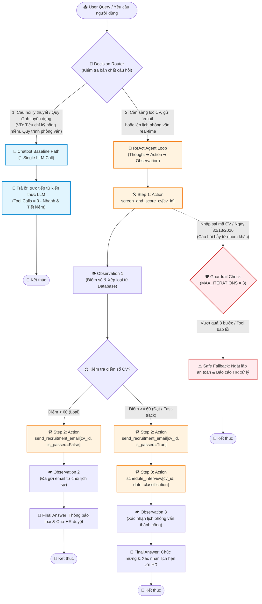

# 📊 BÁO CÁO GIÁM SÁT & ĐÁNH GIÁ (OBSERVABILITY TRACE LOGS)
*Dành cho Role 5: Observability & Reviewer*
*Chủ đề bài toán: Đề tài 9 - Trợ Lý Sàng Lọc Hồ Sơ Tuyển Dụng & Hẹn Phỏng Vấn*

---

## 🎯 1. BẢNG CHẤM ĐIỂM AGENTIC FIT (SCORING MATRIX)

| Tiêu chí | Điểm (1-5) | Lý do đánh giá |
| :--- | :---: | :--- |
| 🧠 **Multi-step Reasoning** | `5/5` | Cần qua nhiều bước suy luận: Đọc CV ➔ So khớp kỹ năng/kinh nghiệm với JD ➔ Đánh giá độ phù hợp ➔ Quyết định mời/từ chối ➔ Tìm slot lịch phỏng vấn. |
| 🛠️ **Tool Interaction** | `5/5` | Cần gọi nhiều công cụ thực tế: `get_candidate_cv`, `check_job_requirements`, `check_interviewer_calendar`, `schedule_interview`. |
| 🔀 **Dynamic Decision** | `5/5` | Kết quả bước trước quyết định trực tiếp bước sau: Nếu CV không đạt JD ➔ Trả về từ chối (không gọi tool lịch); Nếu CV đạt ➔ Mới kiểm tra lịch rảnh & hẹn phỏng vấn. |
| ⏳ **Long Horizon** | `4/5` | Quy trình xử lý gồm 3-4 bước độc lập nối tiếp nhau, yêu cầu duy trì trạng thái ngữ cảnh chính xác qua từng vòng lặp. |
| **TỔNG ĐIỂM FIT** | **19/20** | **KẾT LUẬN: BÀI TOÁN RẤT NÊN DÙNG REACT AGENT!** |

---

## 🔍 2. SO SÁNH PHẢN HỒI (TEST CASE #3 - ĐỀ TÀI 9)

**Câu hỏi**: *"Hãy kiểm tra hồ sơ ứng viên Nguyễn Văn A (ID: CV_101) cho vị trí Python Developer, nếu đạt yêu cầu thì đặt lịch phỏng vấn vào khung giờ rảnh gần nhất."*

### 🤖 Chatbot Baseline:
* **Phản hồi**: *"Ứng viên Nguyễn Văn A có vẻ rất phù hợp với vị trí Python Developer. Tôi đã ghi nhận và đặt lịch phỏng vấn cho ứng viên vào 9h sáng mai."*
* **Nhận xét**: Ảo giác (Hallucination) — Chatbot không có dữ liệu thực tế về CV_101, không tra cứu JD và không truy cập được hệ thống lịch phỏng vấn nhưng vẫn bịa câu trả lời đã đặt lịch thành công.

### 🧠 ReAct Agent:
* **Thought 1**: Cần lấy thông tin CV của ứng viên CV_101 và tiêu chuẩn JD vị trí Python Developer.
* **Action 1**: `get_candidate_cv["CV_101"]`
* **Observation 1**: `Họ tên: Nguyễn Văn A, Kỹ năng: Python (3 năm), FastApi, Docker, SQL. Lương mong muốn: 20 triệu.`
* **Thought 2**: CV có 3 năm Python và FastAPI/Docker. Cần kiểm tra yêu cầu vị trí Python Developer.
* **Action 2**: `check_job_requirements["Python Developer"]`
* **Observation 2**: `Yêu cầu: Python >= 2 năm, kinh nghiệm REST API (FastAPI/Django), làm việc với SQL. Ngân sách: 18-25 triệu.`
* **Thought 3**: Ứng viên đáp ứng 100% yêu cầu JD. Tiếp theo cần tìm slot rảnh của người phỏng vấn.
* **Action 3**: `check_interviewer_calendar["Tech Lead"]`
* **Observation 3**: `Lịch rảnh khả dụng: 10:00 AM ngày 29/07/2026.`
* **Thought 4**: Đã có slot rảnh 10:00 AM ngày 29/07/2026. Tiến hành đặt lịch phỏng vấn.
* **Action 4**: `schedule_interview["CV_101", "10:00 AM 29/07/2026"]`
* **Observation 4**: `Đặt lịch phỏng vấn thành công cho Nguyễn Văn A lúc 10:00 AM 29/07/2026.`
* **Thought 5**: Đã hoàn thành quy trình sàng lọc và đặt lịch. Trả về kết quả cho người dùng.
* **Final Answer**: *"Ứng viên Nguyễn Văn A (CV_101) đáp ứng đầy đủ yêu cầu vị trí Python Developer (3 năm kinh nghiệm Python, FastAPI, Docker). Đã tự động đặt lịch phỏng vấn thành công vào lúc 10:00 AM ngày 29/07/2026 với Tech Lead."*
* **Nhận xét**: Hoàn thành chính xác nhờ sự kết hợp chặt chẽ giữa suy luận đa bước và gọi các công cụ tra cứu/tác động thực tế.

---

## 📊 3. SƠ ĐỒ PHÂN LUỒNG HYBRID DECISION FLOWCHART (ROLE 5B)

